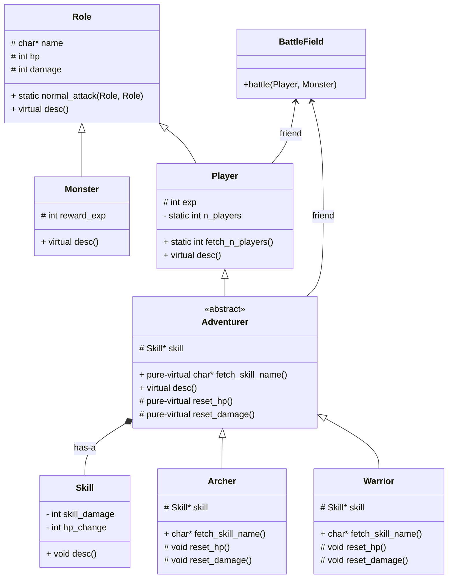

# Role-Play Game on Terminal

* This is a role-play game(RPG) that is executable on terminal or command line. 
* This is an extension of the [archived repository](https://github.com/TrenchHome/terminal-RPG)
    * Especially, more OOP concepts are involved in this updated version.

## Quick Start
* Run `./terminal-rpg` to start the role-play game on terminal

## Class Diagram

## Code Organization
TODO

## Recompile
* To recompile, the dependency `<curses.h>` is required
* Run `g++ main.cpp -o game -lncurses` to recompile and generate a new executable file `game`

